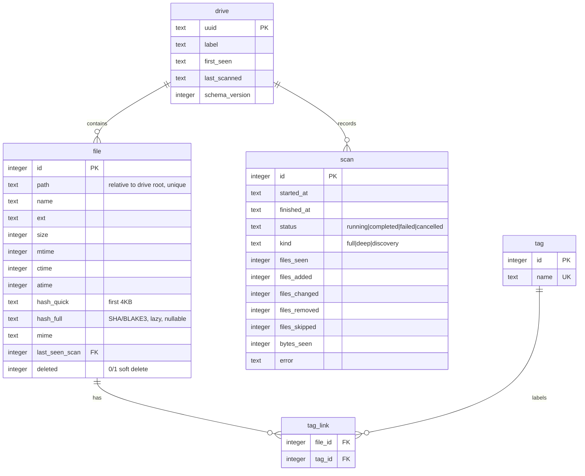

# Data Model

The per-drive `.catalog/index.db` schema. One drive = one self-contained SQLite database.

## `file` — the heart of the catalog

- **`path`** is **relative to the drive root** and **unique** — it's both the identity and the per-file lookup key. See [ADR 0002](../decisions/0002-relative-paths.md).
- **`size` + `mtime`** form the change-detection fingerprint ([Scan Flow](./scan-flow.md)). `size` also serves as **tier-1** of the dupe ladder.
- **`hash_quick`** (first 4KB) is recorded during the scan; **`hash_full`** is **nullable**, computed lazily only when [duplicate detection](../requirements/duplicate-detection.md) or disc-comparison needs it, then cached. See [ADR 0003](../decisions/0003-change-detection-and-hashing.md).
- **`last_seen_scan`** points at the scan that last saw this file on disk — the basis for memory-bounded delete detection.
- **`deleted`** is a soft-delete flag; rows are kept for history and cross-drive coherence.

### Field → feature

| Field | Change-detect | Search | Dupes | Disc-compare |
|---|:-:|:-:|:-:|:-:|
| `path` | id / lookup | ✓ | — | ✓ location |
| `size` | ✓ | ✓ | ✓ tier-1 | ✓ pre-filter |
| `mtime` | ✓ | ✓ | — | — |
| `hash_quick` | — | — | ✓ tier-2 | ✓ |
| `hash_full` | — | — | ✓ tier-3 | ✓ identity |
| `ext` / `ctime` / `atime` | — | ✓ | — | — |

## `scan` — run history

One row per scan run. Drives the UI's *"last scanned … +added / Δchanged / −removed"* summary; `drive.last_scanned` mirrors the latest completed scan. See [Scan Flow](./scan-flow.md).

## `drive` — the drive itself

A single row: the UUID (assigned on first scan), a user label, and `schema_version` so a catalog created by an older app version migrates cleanly on open.

## Search index

An **FTS5** virtual table over `(name, path)` backs [R3 — Search](../requirements/search.md). Maintained alongside `file` writes; omitted from the ER above for readability.

## Indexes

- `file.path` — unique; the per-file lookup during scan
- `file.size` — dupe tier-1 grouping
- `file.hash_quick`, `file.hash_full` — dupe tiers 2 / 3
- `file.last_seen_scan` — the sweep `UPDATE`

## Related

- [Scan Flow](./scan-flow.md)
- [ADR 0001 — SQLite per drive](../decisions/0001-sqlite-per-drive.md)
- [ADR 0002 — Relative paths](../decisions/0002-relative-paths.md)
- [ADR 0003 — Change detection & hashing](../decisions/0003-change-detection-and-hashing.md)
