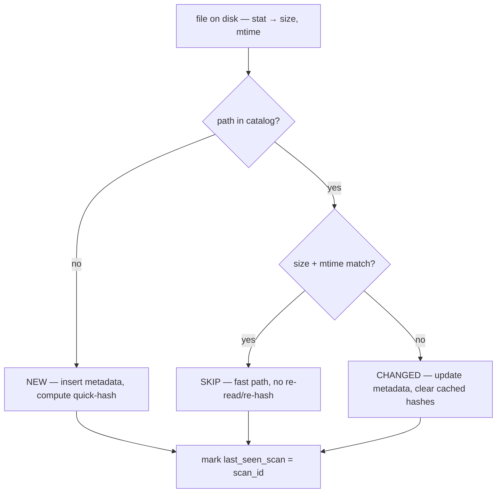
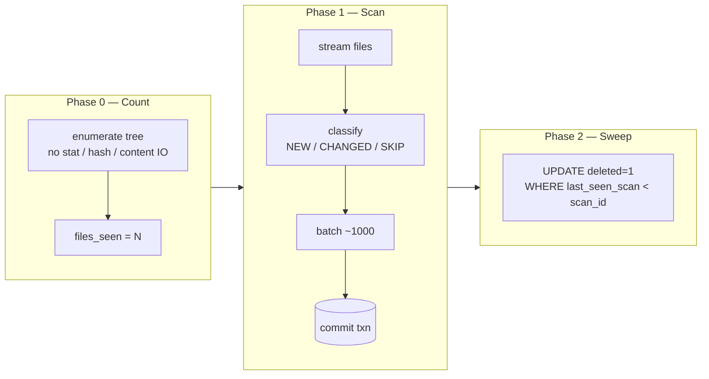

# Scan Flow

How a drive scan works, end to end. Implements [R1 — Indexing](../requirements/indexing.md).

A scan is **idempotent**, **memory-bounded**, and **crash-tolerant**: re-running is always safe, it never holds the file list (or catalog) in memory, and an interrupted scan loses at most the last in-flight batch.

## The idempotent core

For every file found on disk, the scan makes one cheap decision using the `(size, mtime)` fingerprint:



After the walk, any catalog row **not** marked as seen this scan is `DELETED` — soft (the row stays, `deleted = 1`).

> `mtime` usually changes on edits, but some tools preserve it (`rsync --times`, `cp -p`). A **deep rescan** ignores the fast path and re-hashes everything — run it when you suspect drift. See [ADR 0003](../decisions/0003-change-detection-and-hashing.md).

## The three phases



### Phase 0 — Count
Enumeration only: no `stat`, no hashing, no content IO. Gives an exact total for an honest *X of Y* progress bar; the UI shows *"counting… N found"* so it isn't a dead wait. Costs ~5–15% extra on a fresh disc. The alternative (estimate the total from the previous scan's `files_seen`) is recorded as an open option in [ADR 0003](../decisions/0003-change-detection-and-hashing.md).

### Phase 1 — Scan
Streams the tree, classifies each file, accumulates a bounded batch (~1,000), and commits each batch in one SQLite transaction. Progress events stream to the Blazor UI (SignalR) roughly every 200 files.

### Phase 2 — Sweep
A single `UPDATE … WHERE last_seen_scan < scan_id` marks vanished files deleted — without ever holding the set of seen paths in memory.

## Why it never blows up on millions of files

| Concern | What keeps it bounded |
|---|---|
| Walking the tree | Lazy enumerator yields one file at a time — never materializes the list |
| Checking the catalog | Per-file **indexed** lookup on `path` — never loads the whole catalog |
| Writing | Fixed batch (~1,000) per transaction, then cleared |
| Detecting deletes | `last_seen_scan` mark + one final `UPDATE` — no million-path set in RAM |

## Pseudocode

```text
scan(drive):
  scan_id = INSERT scan(started=now, status=running, kind=full)

  # Phase 0 — count
  total = count(enumerate(root, skip=.catalog))
  UPDATE scan SET files_seen = total

  # Phase 1 — scan
  batch = []
  for file in enumerate(root, skip=.catalog):      # streaming
    meta = stat(file)                              # size, mtime
    row  = SELECT … FROM file WHERE path = ?       # indexed, one row
    classify NEW / CHANGED / SKIP
    quick-hash if NEW or CHANGED
    set last_seen_scan = scan_id
    batch.append(change)
    if len(batch) == 1000: commit(batch); batch.clear()
    emit progress every 200 files
  commit(batch)

  # Phase 2 — sweep
  UPDATE file SET deleted=1 WHERE last_seen_scan < scan_id AND deleted=0

  UPDATE scan SET finished=now, status=completed, counts…
```

## Crash behavior

Batched commits mean an interrupted scan has persisted everything up to the last committed batch. Because the scan is idempotent, **re-running** simply picks up where it left off — unchanged files hit the fast path, and the sweep still works (the interrupted run's `scan` row is left `running`/`failed` and ignored).

## First scan

On a drive with no `.catalog/`, the first scan creates the folder, initializes `index.db` (schema v1), and generates the drive [UUID](../requirements/drive-management.md) before Phase 0. An existing catalog from an older app version is migrated on open (`schema_version`).

## Related

- [R1 — Indexing](../requirements/indexing.md)
- [Data Model](./data-model.md) — the `file` and `scan` tables
- [ADR 0002 — Relative paths](../decisions/0002-relative-paths.md)
- [ADR 0003 — Change detection & hashing](../decisions/0003-change-detection-and-hashing.md)
